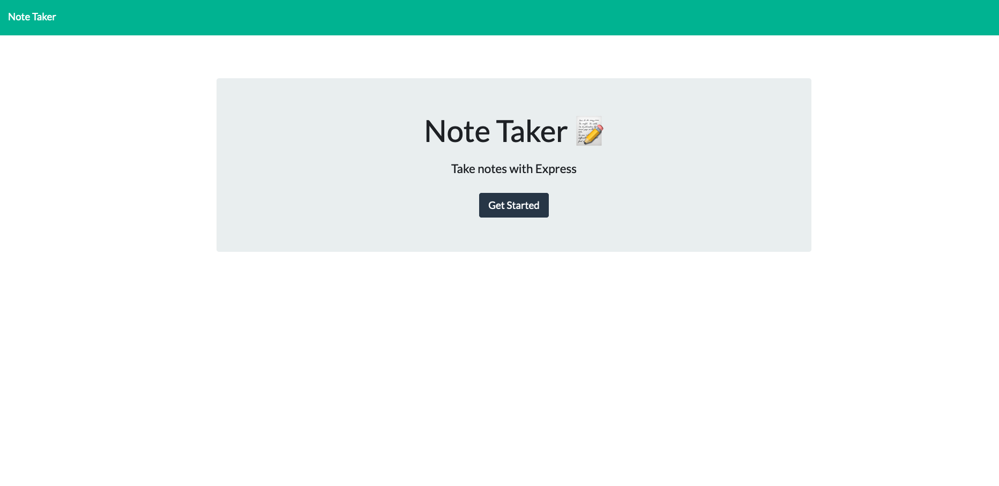
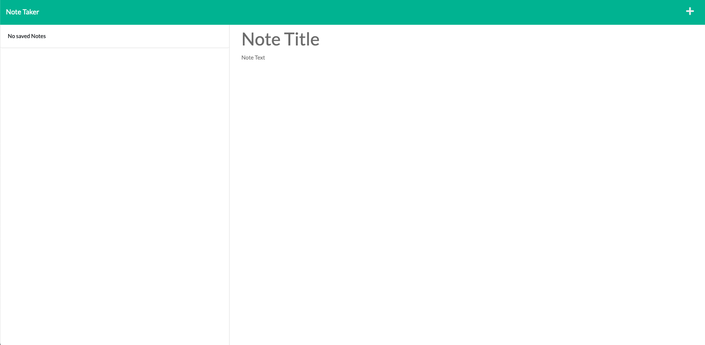
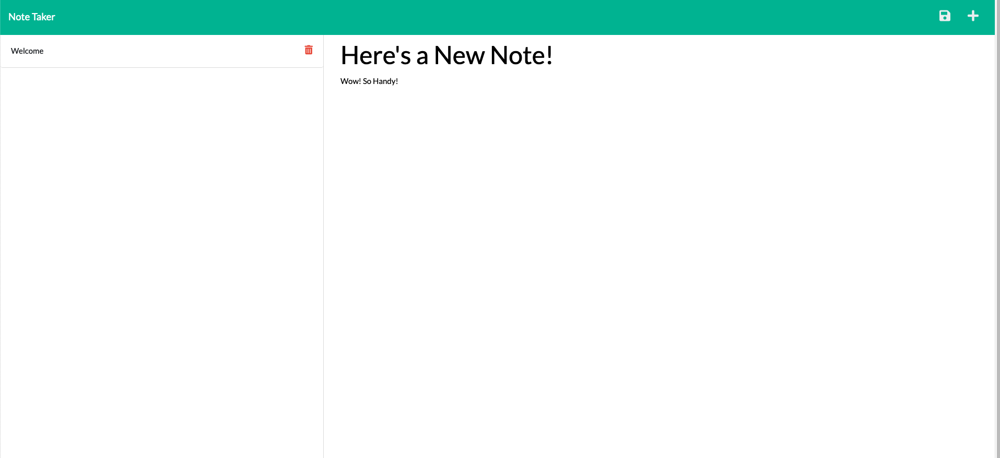

# Challenge-11-Note-Taker

  ## Table-of-Contents
  - [Description](#description)
  - [Installation](#installation)
  - [License](#license)
  - [Usage](#usage)
  - [Contribution](#contributing)
  - [Questions](#questions)
  
  ## Description 
  Need to jot something down but don't have a paper or pen? Why not use this note taker app! Simplely write down a title and a description and you can
  save your note for later. Tap on a note in the left hand sidebar to read a note you saved.
  
  ## Installation 
  Copy the git hub link and paste it into your terminal. You can use software like VScode to edit the javascript!
  Make sure you run "npm install" to import all the dependencies.
  
  ## License 
  [For more information about the license click here](https://choosealicense.com/licenses/mit/)
  
  ## Usage 
  Click the link below. Simply write a note and click the save disk icon to save your note. It will appear in the left hand side bar to you can view the
  note at your convenience.
  
  ## Contribution 
  The repo is public so all are welcome to contribute if you’d like. Let me know if you’d like to help!
  
  ## Questions 
  If you have any questions at all feel free to contact me here or by email:
  
  [GitHub](https://github.com/jonrushing)

  [Email: jonrushingstuff@gmail.com](mailto:jonrushingstuff@gmail.com)

 Deployment Link:

 https://obscure-fortress-08733.herokuapp.com/
 
 
 
 
 
 
 
 
